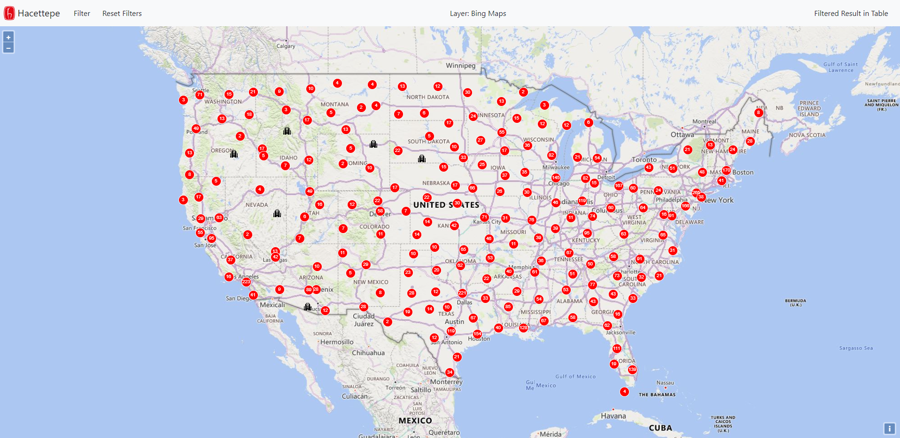
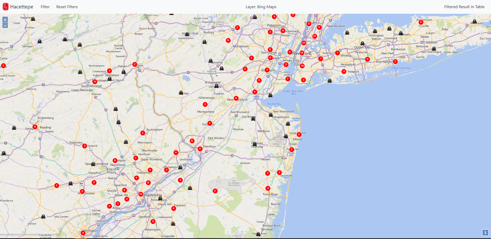
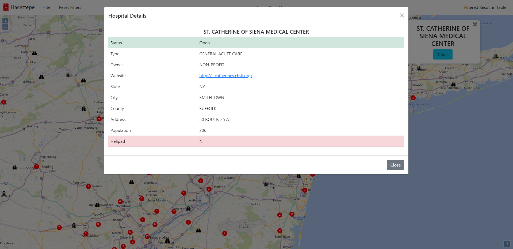
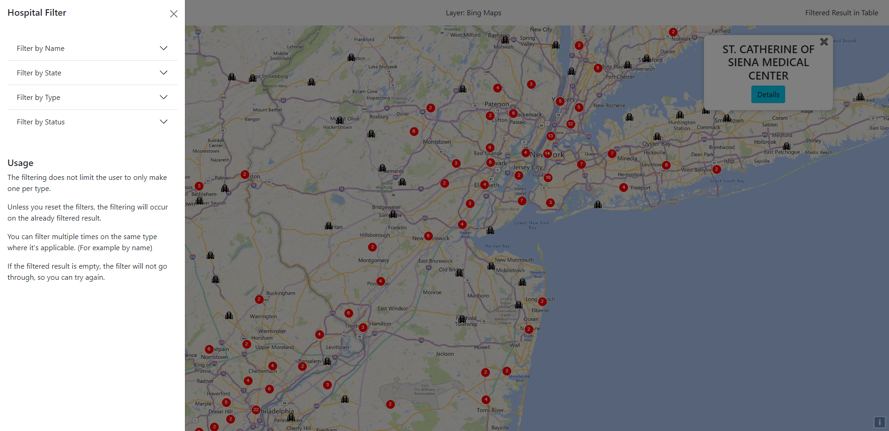
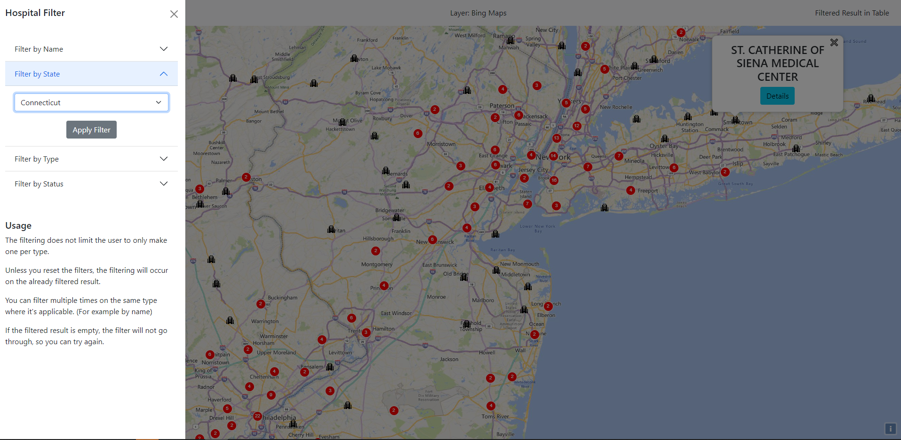
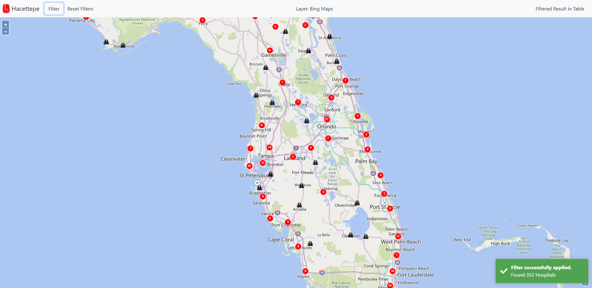
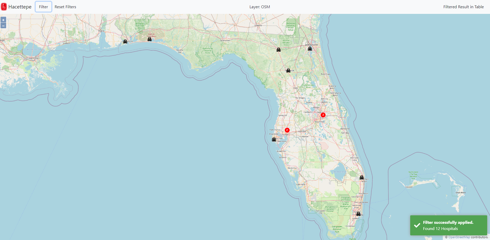
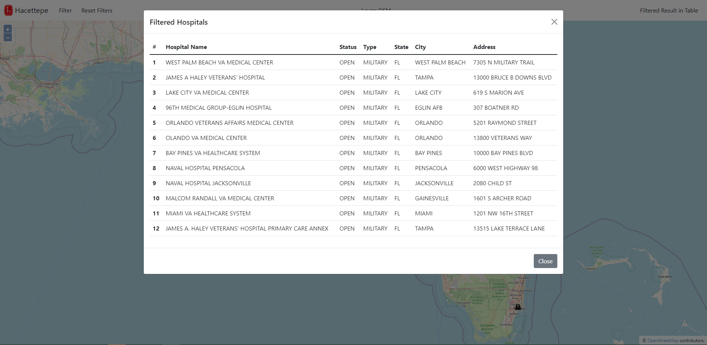

## Not Deployed
#
# Hospitals of US
A user-oriented GIS web application that displays the hospitals of United States with their details on an interactable map. Supports filtering and displaying the results on a table.

